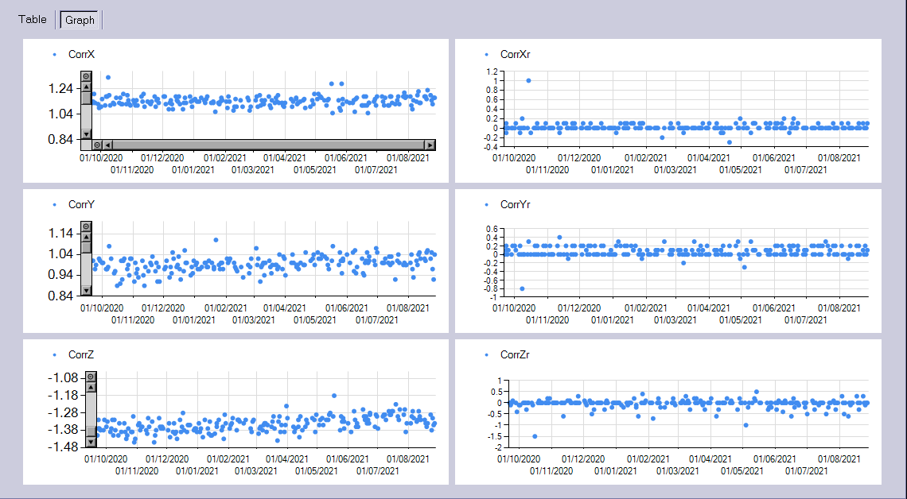

# XVICouchTrends
A .NETv4 app that can be used to fetch Precise/HexaPOD couch error trends from XVI for experimentation purposes.




## Installation


You can use the program on another computer, just copy to that computer the IMAGE folder of your testing patient. That way you will avoid running the program on XVI. Before you copy files to another computer, delete Treatment Projections. This will save you a lot of time. The program only need the .INI files. 

Or, if you are courageous, you can copy XVICouchTrends.exe from the folder "Compiled" to XVI. There is no installation. Do not install any additional software on XVI. 

## How to use

Please read the license first. It is important that you understand it. Although the program only reads data, there is always a chance that something will go wrong.

Each day a phantom should be used for testing. The final goal is to get the errors in couch positoning. You do it like this:

1. Position the phantom off-center with the help of the lasers. Most phantoms have non-central markings on the surface that you can use to be always consistent. 
2. Make a CBCT scan. Register the image with the ct scan and Accept the registration.
3. Use the remote control to move the couch until the final position is reached. Do not stop prematurelly.
4. Re-scan the phantom. Again register the images and Accept the results. If the results are not Accepted, they will not be saved into XVI. 

The results are interpreted like this:

1. The first registration trend will tell you how the distance between the lasers and XVI's isocenter (flexmap) is changing during time.
2. The second registration trend will tell you how accuratelly the couch is executing your registration results during time, ie. how accurate the couch is. Precise couch should have the average error bellow 1 mm all the time. The HexaPOD couch should have the average result bellow 0.3 mm.

To get the data from XVI, use the program like this.

1. Add the path to your patient into *patient_folder.csv*. The path must be absolute and it must point to the IMAGE folder of your patient. You will find it in XVIs clinical database, usually on drive D.
2. Run the program. Click Fetch data. The table data can be copied if needed. The plots will show two groups of points for both registration trends. You can zoom-in.

The program will collect data from XVI's .INI files.

## Important note

**Before using this program see the [licence](https://github.com/brjdenis/XVICouchTrends/blob/master/LICENSE) and make sure you understand it. The program comes with absolutely no guarantees of any kind.**

```
THE SOFTWARE IS PROVIDED "AS IS", WITHOUT WARRANTY OF ANY KIND, EXPRESS OR
IMPLIED, INCLUDING BUT NOT LIMITED TO THE WARRANTIES OF MERCHANTABILITY,
FITNESS FOR A PARTICULAR PURPOSE AND NONINFRINGEMENT. IN NO EVENT SHALL THE
AUTHORS OR COPYRIGHT HOLDERS BE LIABLE FOR ANY CLAIM, DAMAGES OR OTHER
LIABILITY, WHETHER IN AN ACTION OF CONTRACT, TORT OR OTHERWISE, ARISING FROM,
OUT OF OR IN CONNECTION WITH THE SOFTWARE OR THE USE OR OTHER DEALINGS IN THE
SOFTWARE.
```


## Details

Made with Windows Forms for .NET Framework v 4.0.  

## LICENSE

Published under the MIT license. 